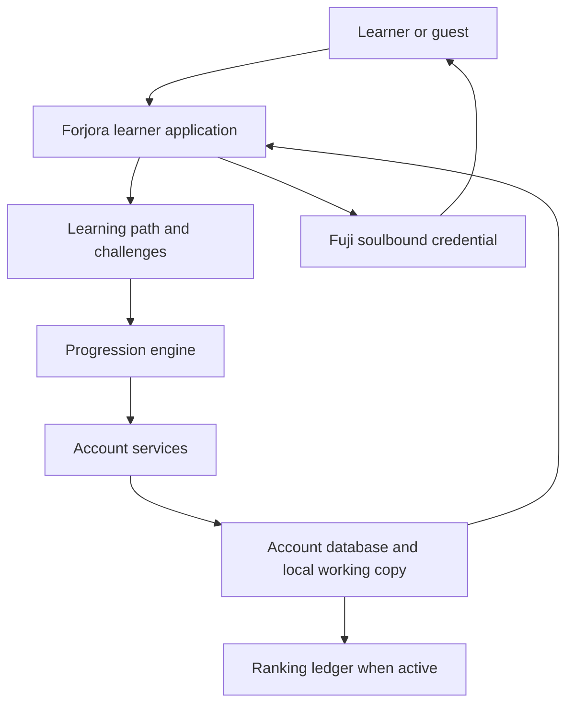
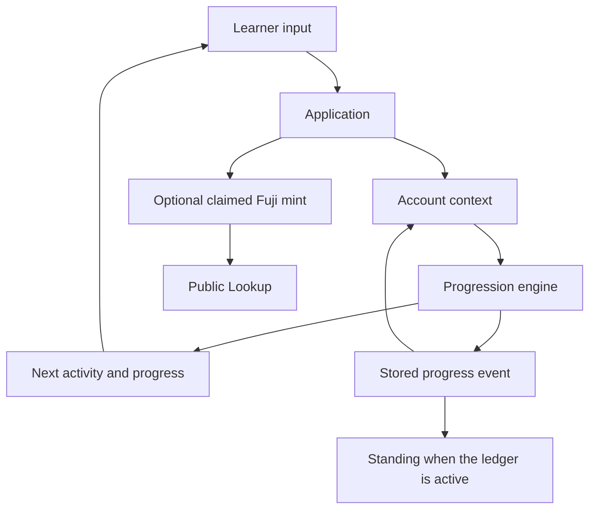
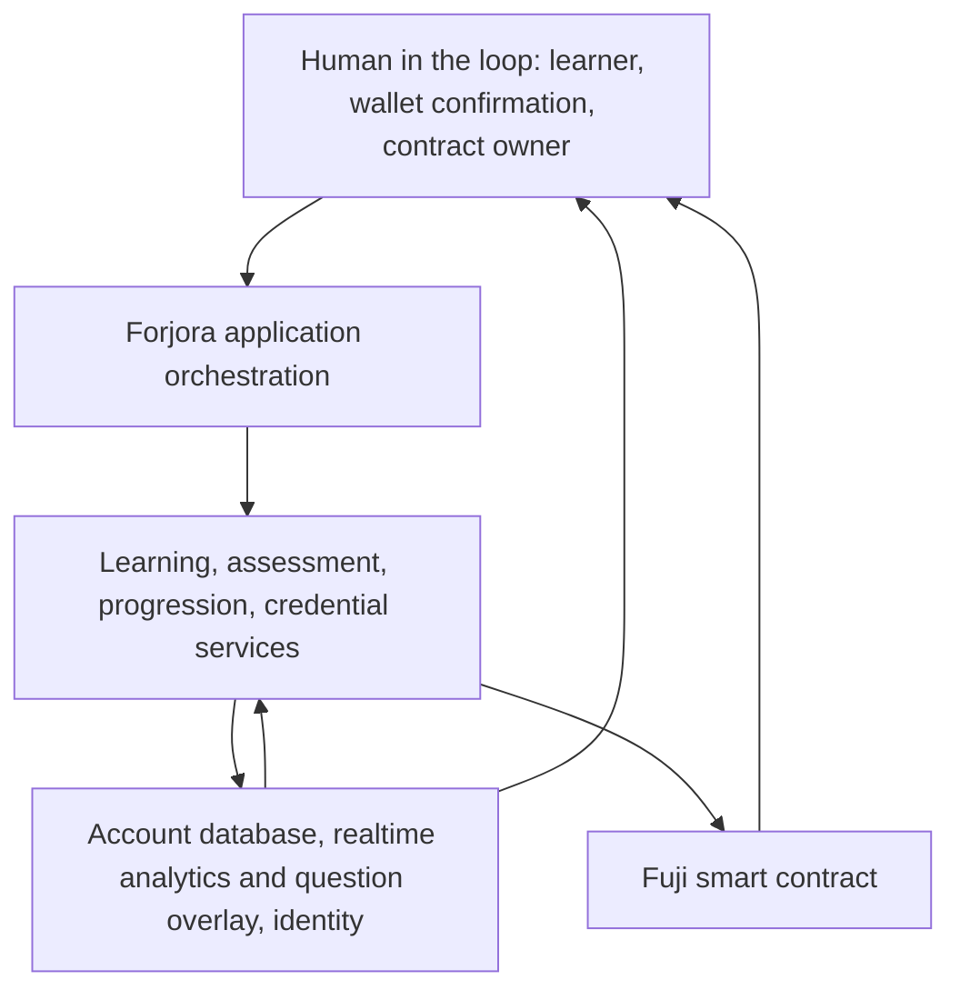
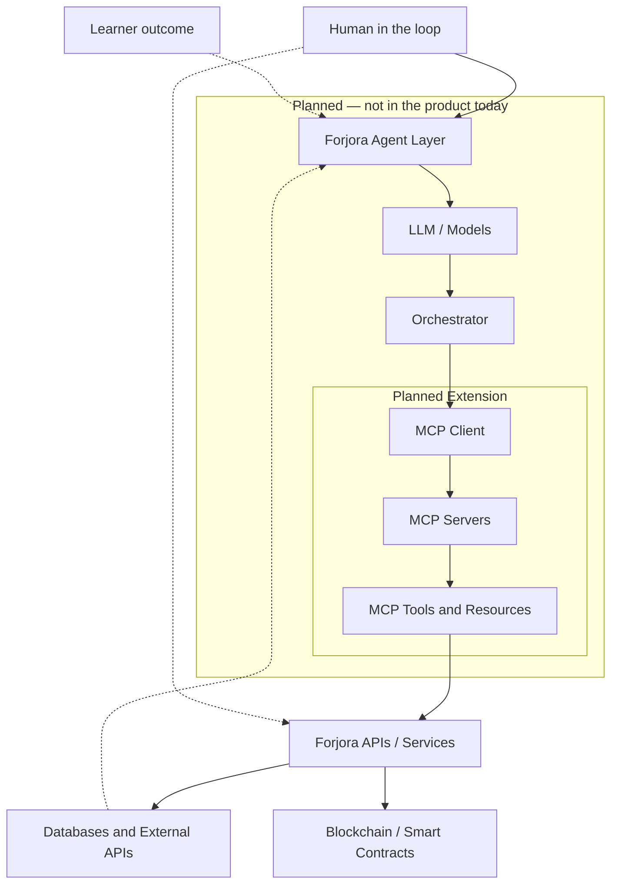

# Forjora — Architecture

Last updated: 5 October 2026

This is the system map for reviewers. It states what Forjora does today, what is only partly built, and what a later learner-progression agent and MCP layer are intended to do.

Related product docs: [Status](./STATUS.md) · [Roadmap](./ROADMAP.md) · [Flowchart](./FLOWCHART.md) · [Progression](./PROGRESSION.md) · [Credential](./CREDENTIAL.md) · [Authorization](./AUTHORIZATION.md) · [Metadata](./METADATA.md)

The independent review pack for the Fuji credential stays in `audit/`. This page does not replace that pack, and it does not open Avalanche C-Chain issuance.

## How to read status

Every major component carries one label.

| Label | Meaning |
| --- | --- |
| **Implemented / Current** | Learners can use this in the shipped product. |
| **Prototype / In development** | A partial surface exists. It is not the finished capability. |
| **Planned / Future** | Direction for a later phase. It is not in the product. |

No language model, agent runtime, or MCP server runs in Forjora today. The dashboard’s next activity is path order: the first unlocked incomplete lesson or quiz. An **AI Builder** badge is a skill ladder for builder-tooling progress. It is not an agent.

---

## 1. Product architecture

**Implementation status:** the learner loop below is **Implemented / Current**. The agent and MCP boxes in [§13](#13-architecture-diagram) are **Planned / Future**.

Forjora is an Avalanche learning product. Learners study network concepts, complete challenges, earn progress, assemble a certificate puzzle, and can record a soulbound credential on Avalanche Fuji. An account holds progress. A wallet is optional until mint or public lookup of an on-chain record.

There is no separate general-purpose application server. The learner app orchestrates account services, the local progression engine, and the wallet. Security rules on the account database are the main off-chain authorization boundary. A small server function materializes community ranking from learning events when that function is active for the project. Otherwise the board replays the same event log.

### What runs today



### Component boundaries

| Component | Status | Responsibility | Boundary |
| --- | --- | --- | --- |
| Learner interface | **Implemented / Current** | Learn hub, track journeys, lesson workspace, challenges, Progress forge, Credential vault, Board, public profiles, Lookup, account and profile | Presents state. It does not decide issuer attestation. Guests can browse Learn, Board, and Lookup. |
| Application services | **Implemented / Current** | Sign-in, profile, progress sync, event publication, wallet link, ranking materialization, public credential read | Account-scoped. Clients cannot write XP totals, rank, issuer records, or attested credentials as raw fields. |
| Learner progression | **Implemented / Current** | One event stream updates path state, XP, levels, achievements, streaks, puzzle history, and credential flags | Derived from allowed learning events. It is a learning record, not an exam and not an on-chain credential. |
| Assessment and quiz | **Implemented / Current** | Foundation, Builder, Advanced, and Mastery challenges. Explanations and official Avalanche references appear after submit. | Easy, Medium, and Hard seat puzzle pieces. Mastery deepens knowledge and does not change the frozen Fuji score scale. |
| Points, XP, levels, badges, streaks | **Implemented / Current** | Points spend on that quiz’s pieces. XP, levels, badges, and UTC streaks come from first-time completions. | Retries replace a section score. They do not farm XP, fragments, or standing. |
| Credential generation and verification | **Implemented / Current** for claimed mint and public Lookup. Issuer-attested mint is **Implemented / Current** on the contract and **Planned / Future** in the learner flow. | Soulbound Fuji record, share URL, and QR. Lookup shows the minted snapshot. | A claimed record means the learner published their scores. An issuer-attested record means the contract owner authorized that snapshot. Lookup proves the token exists. |
| Data layer | **Implemented / Current** for account progress and events. Several reserved collections are closed. | See [§7](#7-data-architecture). | Learner progress stays off-chain. The chain stores the minted snapshot only. |
| Operator question and analytics surface | **Prototype / In development** | Operators flagged for the project can publish question overlays and see a funnel of learning events. | Does not change seating math, attestation, or the learner’s next step. |
| AI / agent layer | **Planned / Future** | A later Learner Progression Agent would recommend from stored context. | It does not exist. Path order is the current “next” behavior. |
| Blockchain layer | **Implemented / Current** on Avalanche Fuji. C-Chain issuance is **Planned / Future** and the production gate is closed. | Soulbound credential contract. | App XP is not the credential. Forjora does not issue credentials on Avalanche C-Chain today. |
| External integrations | **Implemented / Current** | Identity provider, account database, Fuji network reads and wallet transactions, explorer links, artwork URIs, official Avalanche lesson references. | Public chain reads show presence. They do not upgrade a claimed score. |
| Authentication and authorization | **Implemented / Current** for learners. Issuer operations and role dashboards are **Planned / Future**. | Email or Google account; verified email before account-backed progress; optional wallet. | See [§10](#10-security-and-privacy). |
| Analytics | **Prototype / In development** | Best-effort learning events without profile secrets, plus an operator funnel. | Not a learner-facing analytics product, and not agent evaluation. |

### Learner interface

**Implementation status:** **Implemented / Current**

The interface is a single learner application. Major surfaces:

- Learn hub, vertical track path, and lesson workspace
- Challenges (knowledge checks)
- Progress forge: level, XP, streak, badges, puzzle, off-chain learning certificates
- Credential vault: track and learning certificates, puzzle, optional claimed Fuji mint
- Board and public profiles at `/u/:slug` for opted-in names
- Lookup by credential ID, share URL, or QR
- Account, profile, Privacy Policy, and Terms of Service

Unknown addresses show a Forjora 404 with a way home and to Lookup.

The interface may cache a working copy of progress in the browser. The account is the record of progress across devices.

### Application services

**Implementation status:** **Implemented / Current**

Services the application uses directly:

| Service | Role |
| --- | --- |
| Identity | Email/password and Google sign-in. A verification link is required before the learner is treated as signed in for progress. |
| Account database | Learner profile, quiz and puzzle cache, append-only progress events, leaderboard preference, wallet link. |
| Ranking function | When active, writes an XP ledger and board standing from those events. Clients cannot write those totals. |
| Realtime store | Operator question overlays and analytics events. Learner progress does not live here. |
| Wallet and Fuji | The learner’s wallet submits a claimed mint. The app reads the credential back for Lookup. |

Repeated sign-in, signup, and password-reset attempts are throttled in the app, in addition to the identity provider’s own quotas. Optional app attestation exists as client scaffolding. Console enforcement is not the live control.

### Learner progression

**Implementation status:** **Implemented / Current**

Completions become progress events. Those events update path state, XP, achievements, streaks, puzzle history, and credential flags. Opening a page, refreshing, or retrying a quiz does not add XP or streak.

The full model is in [Progression](./PROGRESSION.md). Architecturally, progression is a **derived learning ledger**. It is separate from the on-chain credential.

### Assessment and quiz system

**Implementation status:** **Implemented / Current**, with a question-ops overlay that is **Prototype / In development**.

| Challenge | Learner name | Length | Puzzle seating |
| --- | --- | --- | --- |
| Easy | Foundation | 5 | 3 pieces |
| Medium | Builder | 7 | 5 pieces |
| Hard | Advanced | 10 | 8 pieces |
| Master | Mastery | 12 | None |

The Fuji snapshot still uses the frozen scale: five counted corrects per Easy, Medium, and Hard, and 80 total points. Longer live quizzes feed mastery. They do not raise that cap.

Questions ship in the product catalog. A published overlay can add or replace questions by id for operators. Before submit, the learner sees the stem, options, and an optional hint. The answer, explanation, and reference stay back until submit. A hint that contains the answer is rejected. References must be official Avalanche documentation links.

Labs on ICM messaging and the Developer project are self-claimed learning activities. They are not graded reviews and they are not issuer-attested.

### Points, XP, levels, badges, streaks, achievements

**Implementation status:** **Implemented / Current**

| Signal | What it measures | Where it lives |
| --- | --- | --- |
| Points | Spendable Easy / Medium / Hard score for that quiz’s pieces | Quiz progress. A retry replaces the score. |
| Puzzle fragments | Extra piece progress from assessments. Five fragments become one piece. | Derived with the puzzle |
| XP | First-time learning activity | Derived from events. Board totals prefer the server ledger when that ledger is present. |
| Level | Function of total XP, up to level 99 | Derived |
| Mastery | Accuracy on Easy, Medium, and Hard | Derived and shown on Progress. Separate from XP. |
| Badges | Unlock rules on the same events: learning, performance, puzzle, streak, skill ladders, credentials | Derived in progression state |
| Streak | One qualifying activity per UTC day | Derived. Milestones include 3, 7, 14, 30, 60, 100, 180, and 365 days. |
| Track certificate | Off-chain learning record | Derived from seated pieces or a completed lesson track |
| Board standing | Community ranking | Opt-in. Not issuer-attested and not on-chain. |

Skill ladders run Explorer → Builder → Practitioner → Specialist → Master. Locked badges stay visible unless marked hidden.

### Credential generation and verification

**Implementation status:** claimed mint, vault, share URL, QR, and Lookup are **Implemented / Current**. Issuer signature verification is **Implemented / Current** on the contract. Issuer operations, attested mint in the learner flow, revocation, and versioning are **Planned / Future**.

Two meanings stay separate:

| Record | Meaning |
| --- | --- |
| **Forjora claimed** | The learner published their own scores. |
| **Forjora issuer-attested** | The contract owner authorized that record with a signature. |

A claimed score is not an independently verified assessment. Public lookup shows that a record exists on Fuji. Opening that link is not issuer attestation.

Details: [Credential](./CREDENTIAL.md), [Authorization](./AUTHORIZATION.md), [Metadata](./METADATA.md), and [§8](#8-blockchain-and-credential-architecture).

---

## 2. Agentic AI architecture

**Implementation status:** **Planned / Future**

Forjora does not run a Learner Progression Agent. Nothing in the product calls a language model, stores agent recommendations, or executes agent tools.

What exists instead is deterministic path order. After each completion, the app selects the first unlocked incomplete lesson or quiz on the Avalanche Developer Path. If the path is complete, the next state is “path complete.” That rule is product behavior, documented in [Progression](./PROGRESSION.md). It does not identify skill gaps, recall earlier recommendations, or plan a multi-step program.

### Intended agent

The planned agent is a **decision-support** layer over the existing learning ledger. Its job is to help a learner choose a next activity inside the catalog they already have. It is not a tutor that invents courses, a grader that replaces quizzes, or an issuer that mints credentials.

**Objectives (planned)**

- Read the learner’s stored progress and goals
- Compare that progress with the catalog
- Recommend a next lesson, challenge, or review from activities that already exist
- Explain the recommendation from stored scores and completions
- Record whether the learner accepted, skipped, or finished that recommendation
- Reassess after new outcomes

**Out of scope for the agent, including later phases**

- Publishing a claimed or issuer-attested credential
- Writing XP totals, points, badges, or board rank
- Treating a recommendation as a completed quiz
- Changing another learner’s data
- Describing a claimed score as independently verified

### Inputs and context (planned)

| Context | Today | Planned agent use |
| --- | --- | --- |
| Learner profile | **Implemented / Current.** Account name, avatar, and a learning goal chosen at onboarding: Learn Avalanche, Improve Web3 knowledge, Earn credentials, or Explore Avalanche development. | Read-only input. The goal is a preference, not a completion. |
| Assessment history | **Implemented / Current.** Section scores, retries, and mastery on Easy, Medium, and Hard. | Read-only input. |
| Learning history | **Implemented / Current.** Lesson, module, track, and path completions, plus the event log. | Read-only input. |
| Skill gaps | **Partial display today.** Progress shows overall mastery for Easy through Hard. There is no gap list and no topic-level agent analysis. | Planned comparison of mastery and incomplete catalog items. |
| Goals | The onboarding goal is stored. There is no goal-tracking agent. | Planned input. The learner can change it. The agent cannot mark a goal complete. |
| Previous recommendations | Not stored. | Planned record of what was suggested and what the learner did. |

### Available actions

Today the learner acts through the application: open a lesson, submit a challenge, seat puzzle pieces, opt in or out of the Board, link a wallet, and confirm a claimed mint in the wallet.

The planned agent’s actions are the tools in [§4](#4-agent-tools). Early phases recommend. They do not perform minting, attestation, or ledger writes.

### Reasoning process (planned)

| Step | Planned behavior | Status |
| --- | --- | --- |
| Planning | Order a short sequence of existing catalog items. | **Planned / Future** |
| Decision support | Show the learner the suggestion and the stored facts behind it. | **Planned / Future** |
| Recommendation generation | Return a catalog id, a reason tied to stored fields, and a confidence the product can display honestly. | **Planned / Future** |
| Multi-step execution | Carry out only tools the learner or a human approver has allowed. | **Planned / Future** |
| Outcome evaluation | Compare the later score or completion with the recommendation. | **Planned / Future** |
| Continuous reassessment | Run again after new learning events. | **Planned / Future** |

When this loop exists, the model would propose a catalog id. The application would check that the id exists. The learner would accept the recommendation before it became their next step. High-impact actions would stay with a human, as defined in [§9](#9-human-in-the-loop).

### Intended workflow

```text
Assess → Retrieve Context → Identify Gaps → Reason → Plan
  → Select Action → Execute → Record Outcome → Evaluate → Reassess
```

| Step | What would happen | Status |
| --- | --- | --- |
| Assess | Use a real challenge result or an explicit “review me” request. Quizzes already assess. | Assessment is **Implemented / Current**. An agent invoking it is **Planned / Future**. |
| Retrieve Context | Load profile, scores, completions, goal, and prior recommendations. The app already loads profile and progress for the signed-in learner. | Data load is **Implemented / Current**. Agent retrieval is **Planned / Future**. |
| Identify Gaps | Compare mastery and incomplete lessons with the catalog. | **Planned / Future**. Mastery display is **Implemented / Current**. |
| Reason | Ask the model to explain a gap using only retrieved fields. | **Planned / Future** |
| Plan | Produce an ordered list of catalog activities. | **Planned / Future**. Path order is the current plan. |
| Select Action | Choose one allowed tool, or fall back to path order. | **Planned / Future** |
| Execute | Run that tool, or show the recommendation for the learner to open. | **Planned / Future** |
| Record Outcome | Store acceptance, skip, or the later learning event. Learning events already persist. Agent-outcome records do not. | Events are **Implemented / Current**. Agent outcomes are **Planned / Future**. |
| Evaluate | Score whether the recommendation matched a later completion or score change. | **Planned / Future** |
| Reassess | Repeat after the new outcome. | **Planned / Future** |

Until that loop exists, the shipped cycle remains: learn → challenge → earn → unlock → forge → optional prove. See [Flowchart](./FLOWCHART.md).

---

## 3. LLM / model layer

**Implementation status:** **Planned / Future**

No model is integrated. No model has been selected. No model is production-ready for Forjora. This section is the intended contract for a later choice, not a description of a live integration.

### Model responsibilities (intended)

When a model is introduced, its job is narrow:

- Turn retrieved learner context into a short recommendation and a plain-language reason
- Stay inside the catalog ids the application provides
- Refuse to invent scores, badges, completions, or credential status

The model does not compute XP, seat puzzle pieces, sign transactions, or decide claimed versus issuer-attested. Those stay in the progression engine and the credential contract.

### Prompt and context construction (intended)

A later orchestrator would build the prompt from server-side or rules-checked reads, not from hidden text in a lesson body. The context packet would include:

- Learner id (internal), display name if needed for tone, and the stored learning goal
- Compact progress: level, XP, streak, path percent, incomplete items
- Assessment snapshot: Easy, Medium, Hard, Master scores and mastery
- Catalog slice: only activities the learner is allowed to open
- Prior recommendations and their outcomes, once those records exist
- A fixed instruction: recommend only ids from the slice; never call a score issuer-attested; if unsure, return the path-order next item

Lesson prose and quiz stems are untrusted content. They must not be able to add tools or change the instruction.

### Structured outputs (intended)

The model reply would be a structure the application validates before display:

| Field | Rule |
| --- | --- |
| `activityId` | Must match a catalog id in the supplied slice |
| `kind` | `lesson`, `quiz`, or `review` |
| `reason` | Short text that cites stored fields the application also holds |
| `confidence` | Coarse label such as low, medium, or high. Not a probability the product treats as fact. |
| `fallback` | True when the model declines and path order should be used |

Free text that names a score, a credential status, or an activity outside the slice is discarded.

### Input and output boundaries

| Crosses the boundary | Stays out |
| --- | --- |
| Catalog ids, scores the learner already earned, completion flags, the onboarding goal | Email, passwords, wallet seed phrases, issuer keys |
| The learner’s own recommendation history, once stored | Other learners’ profiles |
| Public catalog text needed to name the activity | Instructions hidden inside learner-authored or imported content that try to override the agent |

The model output is a suggestion. It is not a progress event and not a credential.

### Error handling and fallback (intended)

| Failure | Intended behavior |
| --- | --- |
| Model timeout, rate limit, or invalid structure | Show the path-order next item. Do not block learning. |
| Activity id not in the catalog slice | Discard the reply and use path order. |
| Model mentions attestation or a score the ledger does not hold | Drop that sentence. Credential copy stays on the claimed versus issuer-attested rules. |
| Tool error | Record the error. Do not retry a write. Surface a human path for anything that would change a credential. |

Path order is the fallback because it already ships. A model outage must leave the current product usable.

### Tokens, cost, evaluation, hallucination, oversight (intended)

None of the following is measured today, because there are no model calls.

| Topic | Intended rule |
| --- | --- |
| Tokens and cost | Set a per-learner and per-day budget before any pilot. Log token counts. Cap context to the compact packet above. |
| Evaluation | Hold a labeled set of learner snapshots with an expected catalog id (often the path-order item, sometimes a review of a weak section). A pilot is not “production-ready” until that set is reviewed by a human. |
| Hallucination | The catalog, the event log, and the chain are the sources of truth. The model may not create activities, points, or attestation. |
| Human oversight | The learner accepts or skips every recommendation. Credential publication stays a wallet confirmation or an issuer signature. See [§9](#9-human-in-the-loop). |

A later pilot can be labeled **Prototype / In development** only after a model is actually wired and these checks exist. That label is not available now.

---

## 4. Agent tools

**Implementation status:** every tool below is **Planned / Future** as an agent tool.

Some rows name product data that already exists. That data is read and written by the learner application. It is not exposed to an agent, because there is no agent.

Permissions for a future tool layer:

- The agent acts as the signed-in learner, or as nobody.
- Reads return that learner’s records only, unless the data is already public (Board standing the learner opted into, or a public credential).
- The agent does not receive issuer keys, other learners’ private progress, or the right to mint.
- Writes that change XP, points, badges, or credentials are not agent tools.

| Tool | Purpose | Inputs | Outputs | Data accessed | Status |
| --- | --- | --- | --- | --- | --- |
| Retrieve learner profile | Load the account the recommendation is for | Learner id from the session | Name, learning goal, wallet-link flag, profile completion | Account profile | **Planned / Future.** Profile storage is **Implemented / Current**. |
| Retrieve assessment results | Load challenge scores | Learner id, optional section id | Correct, total, and mastery for Easy, Medium, Hard, and Master | Quiz progress | **Planned / Future.** Scores are **Implemented / Current**. |
| Retrieve learning progress | Load path position | Learner id | Completed lessons, modules, tracks, next path-order item, puzzle summary | Progression state and events | **Planned / Future.** The engine is **Implemented / Current**. |
| Identify skill gaps | List weak or unfinished catalog areas | Progress and mastery already retrieved | Catalog ids with a stored reason (low mastery or not started) | Progress plus the learning catalog | **Planned / Future.** Overall mastery display is **Implemented / Current**. |
| Retrieve learning activities | List what the learner may open | Track or path id | Lessons and challenges, with unlocked or locked | Learning catalog | **Planned / Future.** The catalog is **Implemented / Current**. |
| Recommend activities | Choose one or more catalog items | Gap list, goal, prior recommendations | Structured recommendation in the [§3](#3-llm--model-layer) shape | Catalog slice only | **Planned / Future.** Path order is the current substitute. |
| Assign or recommend challenges | Point at an existing challenge | Section id from the catalog | Challenge id and whether it is unlocked | Quiz catalog and completion flags | **Planned / Future.** The learner already opens challenges themselves. |
| Record learning outcomes | Store what happened after a recommendation | Recommendation id, accepted or skipped, later event id | Outcome record | A future recommendation log | **Planned / Future.** Learning events themselves are **Implemented / Current** and are written by the app, not by an agent. |
| Retrieve analytics | Summarize the learner’s own recent activity | Learner id, time window | Counts by event type | That learner’s analytics events | **Planned / Future.** Operator funnel summaries are **Prototype / In development** and are not an agent tool. |
| Credential status | Read claimed versus issuer-attested for a token | Credential id or linked wallet | Status, chain, contract, minted snapshot | Public Fuji record | **Planned / Future** as a tool. Lookup is **Implemented / Current** for people. The tool must repeat the product meaning of claimed versus issuer-attested and must not mint. |
| Progress tracking | Append a recommendation to the learner’s plan view | Accepted recommendation | The same next-step slot the dashboard already shows | Progression “next item,” only after the learner accepts | **Planned / Future** |

---

## 5. MCP architecture

**Implementation status:** **Planned / Future**

MCP is not currently implemented as a production component of Forjora. The current architecture uses application-level orchestration and direct service integrations. MCP is planned as an extensibility layer.

### Why it is planned

The learner app already calls identity, the account database, the ranking function, the question overlay, and Fuji directly. That is enough for the shipped loop. MCP is a later way to present those same capabilities as standard resources and tools, so an agent can use them under one permission and audit model. MCP does not replace the learning ledger or the credential contract. It does not, by itself, make a claimed score issuer-attested.

### Planned path

```text
Agent → MCP Client → MCP Servers → Tools / Resources → Forjora services and data
```

| Stage | Planned role |
| --- | --- |
| Agent | Decides which resource to read or which tool to call, inside the policy in [§9](#9-human-in-the-loop). |
| MCP client | Holds the learner session, discovers servers, and enforces timeouts and allow-lists. |
| MCP servers | One server per domain so a learning read cannot become a credential write. |
| Tools and resources | Resources are reads. Tools are actions. See [§6](#6-mcp-resources-vs-tools). |
| Forjora services and data | The same account data, catalog, analytics, and Fuji reads the product uses today. |

### Planned servers

All four servers are **Planned / Future**. Schemas below are the intended shapes, not live interfaces.

Shared rules for every server:

| Concern | Intended rule |
| --- | --- |
| Authentication | The MCP client presents the learner’s verified session. Anonymous calls may read only what Lookup and the public Board already allow. |
| Authorization | Least privilege. A server cannot call another server’s write tools. Issuer attestation is not an MCP tool. |
| Error handling | Unknown ids return a not-found error. Invalid fields return a validation error. Timeouts return a retryable error and do not write. |
| Audit logging | Each tool call records actor, tool name, resource id, success or failure, and time. Payloads omit email and secrets. The reserved audit collection in the account database is closed to clients today and is not this log. |
| Rate limiting | Per-session caps before any pilot. A limited agent falls back to path order. |
| Data access | One learner’s private rows, plus public credential and opted-in board data. |

#### Learning MCP server

**Purpose.** Expose the catalog and the learner’s place on the path.

**Resources.** Path outline, track, lesson, unlock state, stored learning goal.

**Tools.** `recommend_activity` (returns a catalog id for the learner to accept). No tool marks a lesson complete.

**Input.** Learner session, optional track id.

**Output.** Catalog objects the app already knows: id, title, kind, unlocked, complete.

#### Assessment MCP server

**Purpose.** Expose challenge definitions the learner may take, and their stored results.

**Resources.** Section summary (Easy, Medium, Hard, Master): length, seating effect, last score, mastery.

**Tools.** `recommend_challenge` (points at an existing section). No tool submits answers or rewrites a score.

**Input.** Learner session, section id.

**Output.** Score snapshot and whether the section seats puzzle pieces.

#### Analytics MCP server

**Purpose.** Expose the signed-in learner’s own recent learning events.

**Resources.** Event counts by type for a time window.

**Tools.** None in the first MCP phase. Analytics stays read-only so an agent cannot stuff the funnel.

**Input.** Learner session, window.

**Output.** Counts already allowed in the analytics vocabulary (lesson completed, quiz completed, and the other learning event names). No email, name, or wallet.

#### Credential MCP server

**Purpose.** Read public credential status for explanation and for the vault.

**Resources.** Credential id, claimed or issuer-attested, chain id, contract, minted score snapshot, puzzle mask.

**Tools.** None that mint, attest, revoke, or replace a token. A future “prepare claimed mint” action, if ever added, would only build a transaction for the wallet to confirm. It is not part of the first MCP phase.

**Input.** Credential id or the learner’s linked wallet.

**Output.** The same honesty the Lookup page uses. Missing or unknown status is treated as claimed.

---

## 6. MCP resources vs tools

**Implementation status:** **Planned / Future**

| | MCP resource | MCP tool |
| --- | --- | --- |
| What it is | Information the agent can retrieve | An action the agent can execute |
| Effect | No change to progress, points, or chain state | May change agent-side state only when the policy allows it |
| Forjora examples | The learner’s path progress. The Easy score and mastery. The list of unlocked lessons. A Fuji credential’s claimed or issuer-attested status. The learner’s onboarding goal. | Recommend a catalog lesson. Recommend an existing challenge. Record that the learner accepted or skipped a recommendation. |
| Examples that stay human or application actions | — | Submitting a quiz. Seating a puzzle piece. Opting into the Board. Linking a wallet. Minting a claimed credential. Signing an issuer attestation. |

A resource can describe a credential. A tool must not create one.

---

## 7. Data architecture

**Implementation status:** mixed. The table is the source of truth for each store.

Progress belongs to the **learner account**. The browser holds a working copy. A wallet is not the account. On link, a non-empty quiz and puzzle snapshot for that wallet in the browser replaces the account copy. An empty wallet does not wipe the account.

| Data | Status of the store | Persistence | What it is |
| --- | --- | --- | --- |
| Learner profiles | **Implemented / Current** | Persistent, account-scoped | Name, learning goal, avatar, wallet link, profile completion. Email stays with the identity provider. |
| Learning tracks and paths | **Implemented / Current** as the product catalog. Reserved database collections for tracks and paths are closed and unused. | Catalog is part of the product. Completion maps are persistent on the account. | Eight Avalanche tracks and the ordered path. |
| Activities | **Implemented / Current** | Catalog plus persistent completion flags | Lessons, modules, self-claimed labs. |
| Questions | **Implemented / Current** catalog. Published overlay is **Prototype / In development**. Reserved question collections in the account database are closed. | Catalog is durable. Overlay is persistent for operators. A quiz session’s unsaved answers are temporary. | Stems, options, and post-submit explanations. |
| Assessment results | **Implemented / Current** | Persistent quiz progress on the account, with a browser working copy | Section scores. Retries replace the section. |
| Points | **Implemented / Current** | Persistent inside quiz progress | Spendable seating scores. Cap 80, five counted corrects per Easy, Medium, and Hard. |
| XP | **Implemented / Current** | Derived from events. A server ledger is written when the ranking function is active. Clients cannot write the ledger. | Activity points. Not the Fuji score. |
| Levels | **Implemented / Current** | Derived from XP | Level and XP remaining. |
| Badges | **Implemented / Current** in progression state. The reserved achievements collection is closed to clients. | Derived, stored with the account progression | Unlock records from events. |
| Streaks | **Implemented / Current** in progression state. The reserved streaks collection is closed. | Derived | Current and longest UTC streak. |
| Puzzle and certificate progress | **Implemented / Current** | Persistent with quiz and progression state | Sixteen pieces, fragments, track certificates, path snapshot. Track certificates are off-chain learning records. |
| Credential flags in the app | **Implemented / Current** | Persistent flags on progression (`claimed`, `attested`, times) | A mirror of what the learner flow recorded. The chain is the public record. |
| Credential records on Fuji | **Implemented / Current** | Blockchain-backed | Soulbound snapshot. One current token per wallet. Remint replaces the current token. The old token’s attested flag does not flip in place. |
| Analytics events | **Prototype / In development** | Persistent append-only events, best effort | Learning event types with secrets stripped. Failure to write does not block learning. |
| Community standing | **Implemented / Current** | Derived. Server standing when the ledger is active; otherwise replay of the event log. | Opt-in board. Not an exam. |
| Agent recommendations | **Planned / Future** | Would be persistent, learner-scoped | Not stored today. |
| Agent outcomes | **Planned / Future** | Would be persistent, learner-scoped | Not stored today. |
| Issuer, role, credential-lifecycle, and audit collections | **Planned / Future** | Reserved and closed to clients | Not the live credential store. The live credential is the Fuji token. |
| Browser working copy | **Implemented / Current** | Temporary relative to the account | Cache. Signing out does not leave progress on the next session’s account. |

---

## 8. Blockchain and credential architecture

**Implementation status:** **Implemented / Current** on Avalanche Fuji (chain ID 43113). C-Chain issuance is **Planned / Future**. The production readiness gate is closed. Launch validation is not approval to launch.

Live contract: [`SkillForgeCredential`](https://testnet.snowtrace.io/address/0x3756be4955530Bba0844C4D2EcF35DB5ed7d90df) at `0x3756be4955530Bba0844C4D2EcF35DB5ed7d90df`. That Solidity name is the legacy on-chain identity. Forjora does not issue credentials on Avalanche C-Chain today.

### EVM architecture

The credential is a soulbound token on an EVM chain. Transfer and approval are disabled. The learner’s wallet is the holder. The contract owner is the issuer key for attestation. Ownership handoff is two-step: a pending owner cannot attest until they accept. The issuer role cannot be abandoned.

The application does not hold issuer keys. Wallet, contract, and mint inputs are checked before a transaction is sent. The learner confirms the transaction in their wallet.

### Smart contract

Freeze v1 is the review snapshot. It is not an audit and not C-Chain issuance.

| Rule | Product meaning |
| --- | --- |
| `mintCredential` | The caller publishes a **claimed** snapshot for themselves, inside the score caps. |
| `mintCredentialWithAuthorization` | The caller mints an **issuer-attested** snapshot. The contract owner’s signature must match this contract, this chain, this learner, this score, this puzzle mask, this artwork hash, a one-time nonce, and a deadline of at most seven days. |
| Score caps | 80 points and five corrects per Easy, Medium, and Hard. |
| Artwork | Short `ipfs://` or `https://` URI. |
| Current token | One current credential per wallet. Minting again assigns a new id. |
| Revocation | Not in this version. |
| Pause | Not in this version. Claimed mint cannot be switched off on-chain. |

The credential id is assigned at mint. The signature authorizes the content, not a pre-chosen token number.

### Issuance, verification, and the two records

```text
Account progress and XP          Wallet, optional until mint
        \                                  /
         \                                /
          claimed mint --------> soulbound token on Fuji
          attested mint -------> same contract, owner signature
                         \
                          public Lookup, share URL, QR
```

**Achievement claimed by a learner.** Track certificates, labs, XP, badges, streaks, and a Forjora claimed mint are learning records or a self-published snapshot. The learner, or their client under account rules, is the source.

**Credential independently verified.** Only an issuer-attested token has that meaning, and only for the snapshot the owner signature covered. The product does not offer that as the default mint. Lookup of a claimed token does not create it.

Unknown or missing status is treated as **claimed**.

### How the app talks to the chain

The app reads credential state through a public Fuji JSON-RPC endpoint and links explorers to Snowtrace. Wallets submit signed transactions. Artwork, when configured, is a short content URI explorers can fetch. None of these reads change claimed into issuer-attested.

### Application data versus the chain

| In the account | On Fuji |
| --- | --- |
| Live XP, lessons, retries, streak, badges | The score and puzzle mask at mint time |
| Can change after mint | Does not follow later quizzes |
| Private to the account, except opted-in board fields | Public token, metadata, and Lookup |

### Security considerations

Anyone can publish a claimed record within the caps. That is self-publication. Attested mint without the current owner’s signature fails. A used, expired, wrong-chain, or wrong-contract signature fails. A stolen issuer key could attest until the owner completes a two-step handoff. This version has no pause and no revocation.

The full threat model for the shipped Fuji product is in the review pack (`audit/THREAT-MODEL.md`). It is not a completed penetration test or a mainnet approval.

---

## 9. Human-in-the-loop

**Implementation status:** human control of learning and claimed mint is **Implemented / Current**. Mentor workflows, appeals, and agent approval queues are **Planned / Future**, because there is no agent to override.

### Where humans are involved today

| Person | What they decide |
| --- | --- |
| Learner | What to open, when to retry, whether to show on the Board, whether to link a wallet, whether to confirm a claimed mint. |
| Guest | Browse Learn, Board, and Lookup without an account. |
| Wallet holder | Confirms the network and the transaction. The app cannot mint silently. |
| Contract owner | Signs an issuer-attested authorization off to the side of the learner flow, or hands the issuer role to a new owner who must accept it. There is no issuer dashboard. |
| Operator | If flagged for the project, can publish question overlays and view an analytics funnel. This is a prototype surface, not a mentor review queue. |
| Reviewer of the freeze pack | Independent review of the credential source is still outstanding. It is not an in-product role. |

Self-claimed labs are not manually reviewed. There is no appeals desk and no way to revoke a token in this version.

### What a future agent may decide on its own

Only after the agent exists, and only inside the catalog:

- Propose a next lesson or existing challenge
- Explain that proposal from stored mastery and completions
- Record that the learner has not yet answered

The proposal is shown. It does not complete the activity.

### What requires a person

| Decision | Who |
| --- | --- |
| Accept, skip, or ignore a recommendation | Learner |
| Submit a challenge | Learner |
| Seat pieces and name the path credential | Learner |
| Claimed mint | Learner, in their wallet |
| Issuer-attested mint | Contract owner’s signature, then the learner or a permitted submitter sends the transaction |
| Publish or retire questions | Operator, on the prototype surface today; a staff role later |
| Change XP totals, badges, or another person’s progress | Not an agent action. Server ranking is derived from events under rules. |
| Treat a record as independently verified | Only the issuer-attested path |
| Override the agent | Learner, by choosing a different activity. A staff override queue is **Planned / Future**. |
| Escalation | **Planned / Future:** credential, safety, or privacy questions leave the agent and go to a person. Today the learner uses Lookup, the wallet, and Forjora’s public policies. |
| Appeals and corrections | **Planned / Future.** A claimed mint can be replaced by a newer token. It cannot be flipped to attested in place. There is no revocation. |

---

## 10. Security and privacy

**Implementation status:** learner, wallet, and Fuji controls below are **Implemented / Current** unless a row says otherwise. Agent and MCP controls are **Planned / Future**.

### Current model

| Control | What Forjora does |
| --- | --- |
| Authentication | Email/password or Google. Verified email before account-backed progress. Password reset through the identity provider. |
| Authorization | The signed-in learner reads and writes their own profile, quiz cache, and allowed progress events. Other learners’ private progress stays closed. Opted-in board fields are readable for the community ranking. |
| Roles | Learner, guest, contract owner, and a prototype operator flag. Issuer organization roles exist only as reserved names. No admin dashboard uses them. |
| Least privilege | Clients cannot write XP totals, rank, issuer records, credential lifecycle rows, or the audit collection. |
| API authentication | The app uses the identity session against account rules. There is no general application API. Public Fuji reads do not grant write access. |
| Secrets | Issuer and deployer keys stay with operators. They are not in the learner app. |
| Input validation | Progress events must use an allowed type and source. Analytics payloads drop contact fields and nested objects. Quiz items must meet the question rules. Mint parameters are checked before a transaction is offered. |
| Rate limiting | App-side throttles on sign-in, signup, and password reset, plus the identity provider’s quotas. There is no separate application gateway to rate-limit. |
| Audit logs | A reserved audit collection is closed and unused. Chain mints emit an on-chain event. That is not a full product audit log. |
| Learner data | Email stays with the identity provider. Analytics events are written without those contact fields. Board names are opt-in. Wallet display on the board is an optional truncated hint. |
| Blockchain privacy | Fuji tokens, scores, and holder addresses are public. Learners should treat a mint as publication. |
| Credential issuance | Claimed mint is self-publication inside caps. Attestation requires the owner signature described in [Authorization](./AUTHORIZATION.md). |
| Human approval for high-impact actions | Wallet confirmation for claimed mint. Owner signature for attestation. |

Optional app attestation is scaffolding. It is not enforced as the live barrier. The production gate for C-Chain stays closed.

### Planned model for an agent

These controls are requirements for a later phase. They are not implemented.

| Control | Requirement |
| --- | --- |
| Least-privilege tools | The tool list in [§4](#4-agent-tools) is the whole surface. No blanket database access. |
| Session binding | Every call carries the verified learner session. |
| Prompt-injection protection | Catalog and lesson text cannot add tools, change the system instruction, or override claimed versus issuer-attested copy. |
| Tool abuse prevention | Allow-listed tools, schema checks, no writes to XP or credentials, no cross-learner reads. |
| Rate limiting | Per-learner caps on model and tool calls, with fallback to path order. |
| Audit logs | Actor, tool, ids, result, time. No secrets in the log. |
| Sensitive data | The model context excludes email, secrets, and other learners’ private rows. |
| High-impact actions | Mint, attestation, question publication, and ledger changes stay with a person. |

### Threats an agent would add

These are considerations for the planned design, not a claim that they are already mitigated. The shipped threat model remains the review pack.

| Threat | Why it matters |
| --- | --- |
| A lesson or question tells the model to ignore its rules | Untrusted catalog text must not expand tools or mint. |
| The model states that a claimed token was independently verified | Copy and structured output must keep the two credential meanings. |
| A tool is tricked into reading another learner’s progress | Authorization is per session, not per model argument. |
| Repeated tool calls farm cost or spam recommendations | Budgets and rate limits, then path-order fallback. |
| A recommendation is stored as if the learner finished the work | Outcomes are separate from progress events. Only the app records a real completion after a real activity. |
| An MCP server is given issuer authority | Attestation stays off MCP. |

---

## 11. Observability and evaluation

**Implementation status:** the “today” column is what exists. Everything in the “planned” column is **Planned / Future**.

| Signal | Today | Planned for an agent |
| --- | --- | --- |
| Agent traces | None | Step log for the workflow in [§2](#2-agentic-ai-architecture), with secrets removed |
| Tool-call logs | None | The audit record in [§5](#5-mcp-architecture) |
| Recommendation outcomes | None | Accepted, skipped, or followed by a later completion |
| Error monitoring | Quiz validation, sync timeouts, and failed analytics writes fail closed or degrade. Chain reverts surface as failed transactions. There is no product-wide monitoring suite. Production monitoring is part of the unopened launch gate. | Model and tool errors counted, with path-order fallback visible |
| Model performance | No model | Quality against a human-labeled snapshot set |
| Latency | Not published as an agent metric | Model and tool latency budgets |
| Cost and tokens | No model spend | Per-learner budgets |
| Learner progression metrics | Level, XP, mastery, streak, path percent, and the operator analytics funnel | Same metrics, joined later to recommendation outcomes |
| Acceptance and rejection | The learner simply opens something else | Explicit accept or skip |
| Evaluation datasets | None | Snapshots plus the expected catalog id |
| Human review | Issuer signature is human. Lab work is not reviewed. Freeze review is outstanding. | Sample of recommendations reviewed before any wider pilot |
| Continuous improvement | Question overlay can be published by an operator | Catalog and prompt changes reviewed against the evaluation set |

Analytics events use a fixed vocabulary: quiz started and completed, lesson, module, track, and path completed, XP earned, achievement, streak milestone, puzzle piece, puzzle completed, credential claimed, credential attested. They do not award XP. They are best effort.

---

## 12. Data flow

### Shipped path

```text
Learner input
  → Application
  → Account context (profile, quiz cache, events)
  → Progression engine (path order, XP, badges, streak, puzzle)
  → Learner sees the next activity and updated progress
  → Outcome stored as a progress event and quiz state
  → Ranking function updates standing when it is active
  → Optional claimed mint on Fuji
  → Public Lookup
  → Later sessions load the same account context
```



The return arrow is the feedback loop that exists today: the next session’s context is the stored event log, not an agent memory.

### Planned agent path

This path is **Planned / Future**. It starts only after the shipped context load.

```text
Learner input
  → Application
  → Retrieve learner context
  → Agent
  → LLM reasoning
  → Tool or MCP request
  → Learning, assessment, analytics, or credential read services
  → Data sources
  → Tool result
  → Agent decision
  → Recommendation or allowed action
  → Learner
  → Outcome
  → Stored result
  → Future agent context
```

Learner outcomes feed the next retrieval. They do not skip the progress rules. A recommendation outcome is not itself XP.

### Failure and escalation

| Failure | What happens |
| --- | --- |
| Sign-in or unverified email | The learner can browse as a guest. Account progress stays closed until verification. |
| Progress sync timeout | The working copy remains. The write is not treated as a second reward. |
| Analytics write fails | Learning continues. The funnel may miss an event. |
| Invalid quiz item or disallowed event source | No reward is recorded for that write. |
| Wallet on the wrong network, or the learner rejects the transaction | No new token. |
| Attestation signature expired, reused, or signed for another chain or contract | The contract rejects the mint. |
| Model or tool failure, once an agent exists | Path order is shown. Learning is not blocked. |
| The learner disputes a credential or a recommendation | Today they can remint a new claimed snapshot or ignore the path-order suggestion. A staff appeal queue is **Planned / Future**. Anything that would attest, revoke, or rewrite another person’s record escalates to a person and is not an agent tool. |

---

## 13. Architecture diagram

### Today

**Implementation status:** **Implemented / Current**



### Target, including the planned extension

**Implementation status:** the agent, model, orchestrator, and MCP tiers are **Planned / Future**. Services, databases, and the Fuji contract exist as described in [§1](#1-product-architecture) and [§8](#8-blockchain-and-credential-architecture).



The dotted arrows are feedback. Stored outcomes and the human’s accept or skip become the next context. The dotted line from the human to services is the shipped path: people use the application directly, with no agent in between.

MCP Client, MCP Servers, and MCP Tools & Resources sit entirely inside **Planned Extension**.

---

## 14. Implementation roadmap

This sequence is the agentic extension. It does not replace product phases 1–7 in [Roadmap](./ROADMAP.md). Those phases still govern learning content, issuer operations, the closed production gate, and C-Chain. An agent does not open that gate.

### Phase 1 — Current

**Implementation status:** **Implemented / Current**, with the partial items already named in [Status](./STATUS.md).

The existing platform: account, eight-track path, assessment, progression, puzzle, claimed Fuji credential, Lookup, community ranking, and direct service integrations. Path order is the next-activity rule. Issuer-attested mint exists on the contract and is not the learner default.

### Phase 2 — Agent

**Implementation status:** **Planned / Future**

Learner context retrieval for a recommendation, reasoning over that context, recommendations that cite catalog ids, tool execution limited to read and recommend, and outcome tracking for accept or skip. Fallback remains path order. No credential tools that write.

A pilot in this phase can be called **Prototype / In development** only once the model and the checks in [§3](#3-llm--model-layer) are actually present.

### Phase 3 — MCP

**Implementation status:** **Planned / Future**

MCP client, the four servers in [§5](#5-mcp-architecture), resources versus tools, permissions, and auditability. MCP wraps services. It does not become a second learning ledger or a second issuer.

### Phase 4 — Intelligent learning loop

**Implementation status:** **Planned / Future**

Continuous reassessment, adaptive ordering of existing activities, personalized challenges drawn from the real bank, and cohort views that stay community intelligence. Cohort data must not be described as issuer attestation or as an on-chain exam.

Autonomous execution in this phase still means “advance a plan the learner accepted.” It does not mean silent minting, silent attestation, or silent XP. Human controls in [§9](#9-human-in-the-loop) remain.

| Agentic phase | Relationship to the product roadmap |
| --- | --- |
| Phase 1 — Current | Product phases 1–5 as shipped or partial. Phase 6 stays closed. |
| Phase 2 — Agent | New work. It depends on the current ledger staying honest. |
| Phase 3 — MCP | New work. It depends on Phase 2 tools being real and scoped. |
| Phase 4 — Intelligent learning loop | New work. Partner verification of **attested** credentials stays in product Wave E and still requires the production gate. |

---

## 15. Technical decision records

### An agent rather than a chatbot

**Status:** accepted as a future direction. Not built.

A chat window can explain a lesson the catalog already contains. It cannot, by itself, bind a suggestion to a real activity id, a stored score, and a later outcome. Forjora’s progression is an event ledger with unlock rules. The useful assistant is one that reads that ledger and points at the next real activity, then records what the learner did. That is an agent with tools and a fallback, not an open conversation that invents a path.

The current product uses path order instead, because that rule is inspectable and already matches the unlock graph.

### Application orchestration now, MCP later

**Status:** accepted for the current product. MCP is **Planned / Future**.

The loop needs a few integrations: identity, the account database, a ranking function, a question overlay, and Fuji. The learner application calls those directly under database rules and wallet confirmation. Adding a protocol layer before those calls are stable would duplicate trust boundaries. MCP is reserved for the moment an agent needs a standard, auditable tool surface. Until then, orchestration stays in the application.

### Separate learning and achievement ledgers

**Status:** accepted. **Implemented / Current.**

XP, badges, streaks, and the Board are derived from learning events. The Fuji token is a minted snapshot with its own authority: the learner for a claimed record, the contract owner for an issuer-attested record. Mixing them would let a client-written event look like an issuer’s signature, or let a public token pretend to be a live XP feed. They stay separate on purpose. See [Credential](./CREDENTIAL.md).

### Verifiable credentials, with an honest status

**Status:** accepted. **Implemented / Current** on Fuji for the soulbound record.

A public token lets anyone check that a snapshot was written, and whether that write was self-claimed or owner-signed. The verification is of the record’s presence and its authorization path. It is not a general Avalanche certification. Product copy keeps **Forjora claimed** and **Forjora issuer-attested** distinct so “verifiable” is not read as “independently assessed” for a claimed score.

### EVM infrastructure

**Status:** accepted for Fuji. C-Chain issuance is **Planned / Future** and gated.

The credential needs a public chain with wallet signatures, a contract that can refuse transfers, and a signature scheme bound to one contract and one chain. An EVM soulbound token provides that. Avalanche Fuji is the live network. Mainnet issuance waits on independent review, issuer custody, monitoring, and an opened production gate. An environment switch cannot open it.

### MCP as a future extensibility layer

**Status:** accepted as a future direction. Not built.

MCP is not currently implemented as a production component of Forjora. The current architecture uses application-level orchestration and direct service integrations. MCP is planned as an extensibility layer so a later agent can reach learning, assessment, analytics, and credential **reads** through separate servers, each with its own permission and audit story. It is not a prerequisite for the learner loop, and it is not an issuer.

---

## 16. Documentation standards

This page is technical product architecture for developers, reviewers, investors, and grant evaluators.

| Rule | Practice |
| --- | --- |
| Status is explicit | Implemented / Current, Prototype / In development, or Planned / Future on major components. |
| Claims match the product | A behavior is described as shipped only when learners can use it. |
| Honesty copy stays stable | Claimed and issuer-attested mean the same thing here as in [Credential](./CREDENTIAL.md) and [Status](./STATUS.md). |
| One topic, one home | Progression math stays in [Progression](./PROGRESSION.md). Signature details stay in [Authorization](./AUTHORIZATION.md). This page owns boundaries, the agent plan, and MCP. |
| Planned work is still specific | Future tools name real Forjora data. They are still labeled planned. |
| No operator runbook | Setup, deploy steps, and RPC endpoints belong outside the product docs. |

When the product gains a real model call, an agent tool, or an MCP server, this page’s labels move in the same change as [Status](./STATUS.md). Until that change, those labels stay **Planned / Future**.
