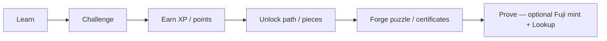
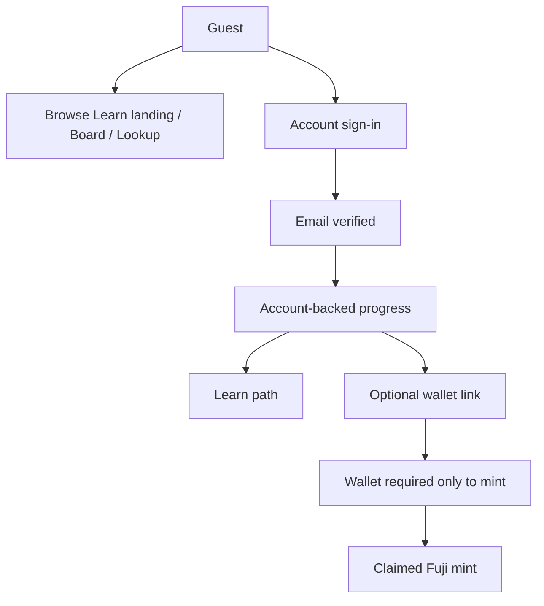
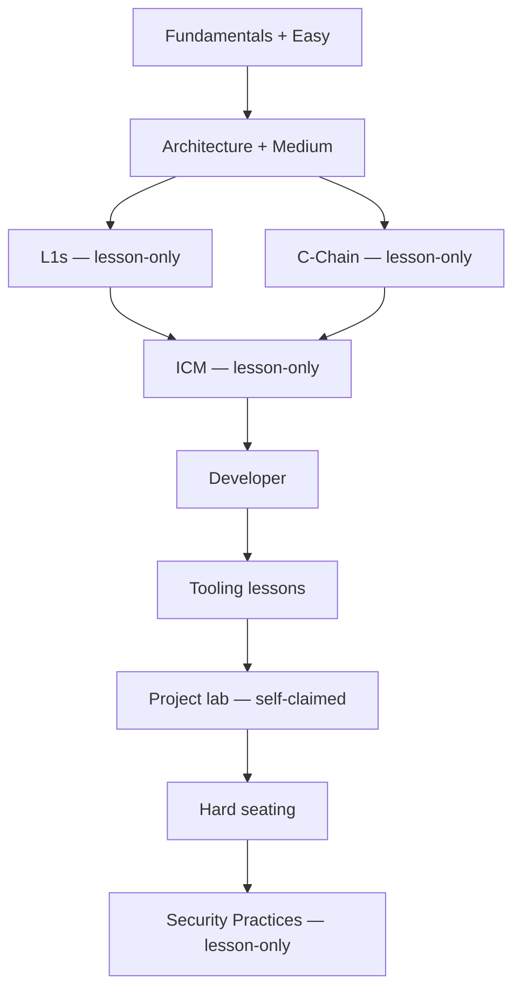
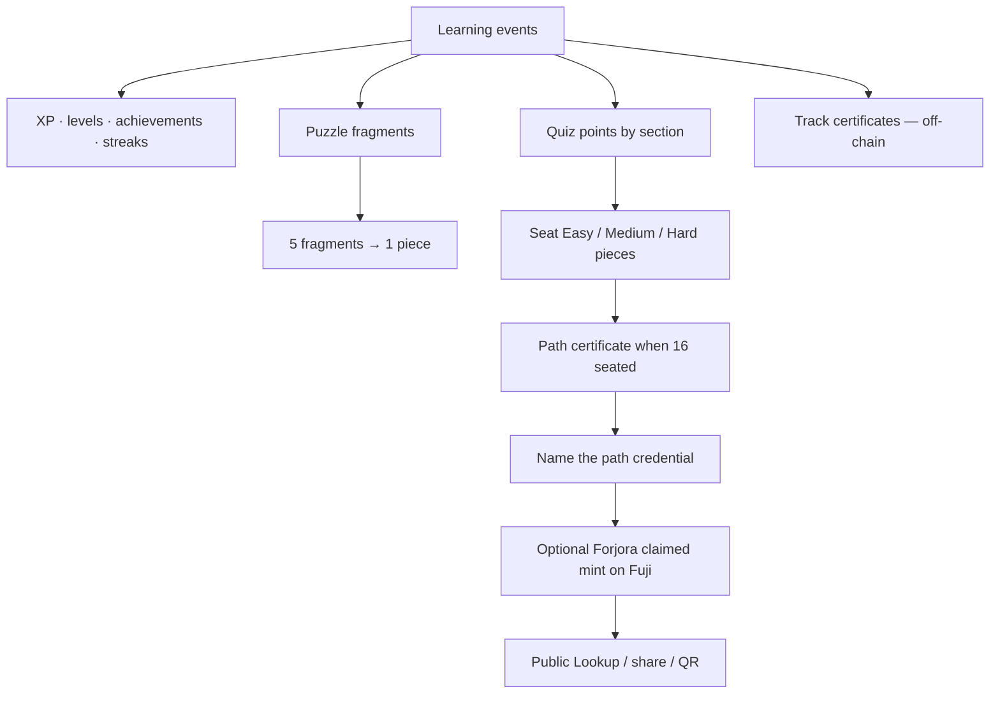
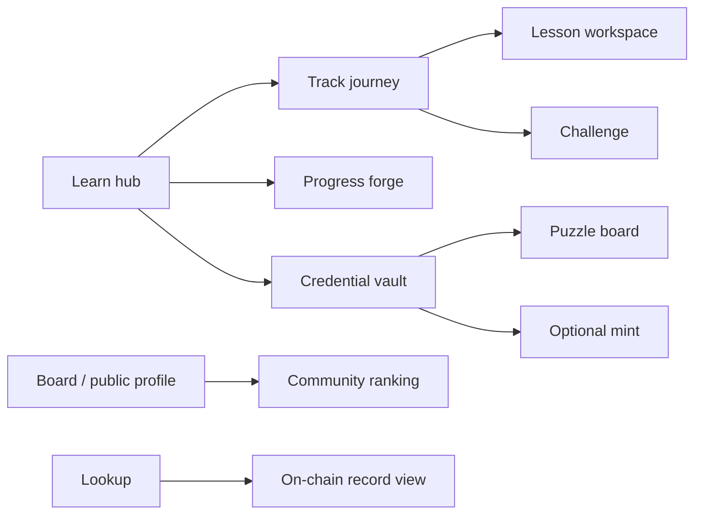
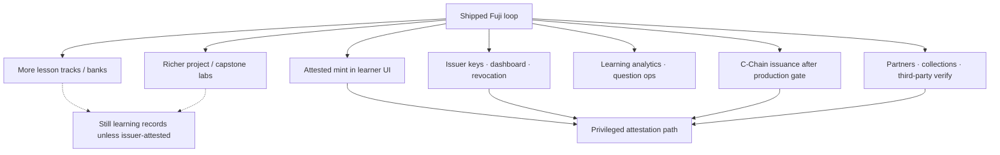

# Forjora — System flow

How the product moves a learner from account to proof — what ships today, and what can be added without blurring claimed learning with issuer attestation.

Related: [Status](./STATUS.md) · [Roadmap](./ROADMAP.md) · [Progression](./PROGRESSION.md) · [Credential](./CREDENTIAL.md)

---

## 1. Product loop (shipped)



| Stage | What happens today |
| --- | --- |
| Learn | Seven Avalanche tracks, ordered lessons, self-claimed project lab on Developer |
| Challenge | Easy / Medium / Hard seating quizzes; Mastery deepens knowledge without changing Fuji seating |
| Earn | First-time XP, puzzle fragments, points; retries do not farm rewards |
| Unlock | Track and module gates; seating points unlock that quiz’s reserved pieces |
| Forge | Sixteen-piece puzzle, track certificates (off-chain), path snapshot |
| Prove | Optional claimed soulbound mint on Fuji; public Lookup / share URL / QR |

---

## 2. Identity and access (shipped)



- An **account** holds progress. A **wallet** is not a signup gate.
- Linking a wallet can adopt that browser’s quiz/puzzle snapshot onto the account; it does not become the account.
- Board standing and XP are not issuer-attested and not on-chain.

---

## 3. Learning path (shipped)



| Kind | Tracks | Seating effect |
| --- | --- | --- |
| Quiz tracks | Fundamentals, Architecture, Developer | Easy 3 / Medium 5 / Hard 8 pieces |
| Lesson tracks | L1s, C-Chain, ICM, Security | Track certificate when complete; no seating quiz |
| Project lab | Developer module before Hard | Self-claimed lessons only — not graded, not issuer-attested |

Puzzle seats **0–15** stay frozen. There is no fourth seating quiz.

---

## 4. Progress → certificates → on-chain (shipped)



Honesty:

| Record | Meaning |
| --- | --- |
| Track / learning certificate | Off-chain path progress |
| Project lab complete | Self-claimed learning activity |
| Forjora claimed mint | Learner published their own score snapshot on Fuji |
| Forjora issuer-attested | Contract owner authorized the record — **not** the default learner mint |

Looking up a Fuji record proves presence on-chain. It does not turn a claimed score into an issuer assessment.

---

## 5. Surfaces a learner meets (shipped)



---

## 6. What can be added (planned)

Extensions that fit the same honesty model — claimed learning stays distinct from attestation.



| Addition | Role | Must not imply |
| --- | --- | --- |
| More path content / labs | Deeper learning and self-claimed practice | Foundation exam or graded review |
| Issuer dashboard + attested mint UI | Privileged attestation | That claimed scores were always attested |
| Revocation / versioning | Credential lifecycle | That Lookup alone is certification |
| C-Chain issuance | Production network after gate opens | That Fuji claimed equals Mainnet diploma |
| Partners / ecosystem | External verification of **attested** records | That Board rank or claimed mint is partner-attested |

Production readiness (independent review, issuer custody, monitoring, C-Chain deploy) stays on the Security & Launch gate — see [Roadmap](./ROADMAP.md).

---

## 7. One-page map

```text
                    ACCOUNT (progress)          WALLET (optional → mint)
                           │                              │
                           ▼                              │
          ┌──────── Learn path (7 tracks) ────────┐       │
          │  lessons → lab (claimed) → quizzes    │       │
          └───────────────┬───────────────────────┘       │
                          ▼                               │
              XP · badges · streak · Board                │
                          │                               │
                          ▼                               │
              Puzzle (16) · track certs (off-chain)       │
                          │                               │
                          ▼                               │
              Path credential named ──────────────────────┘
                          │
                          ▼
              Claimed Fuji mint → Lookup
                          │
                          ╳  (not default)
                          ▼
              Issuer-attested  ← planned ops / UI
```
