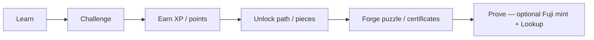
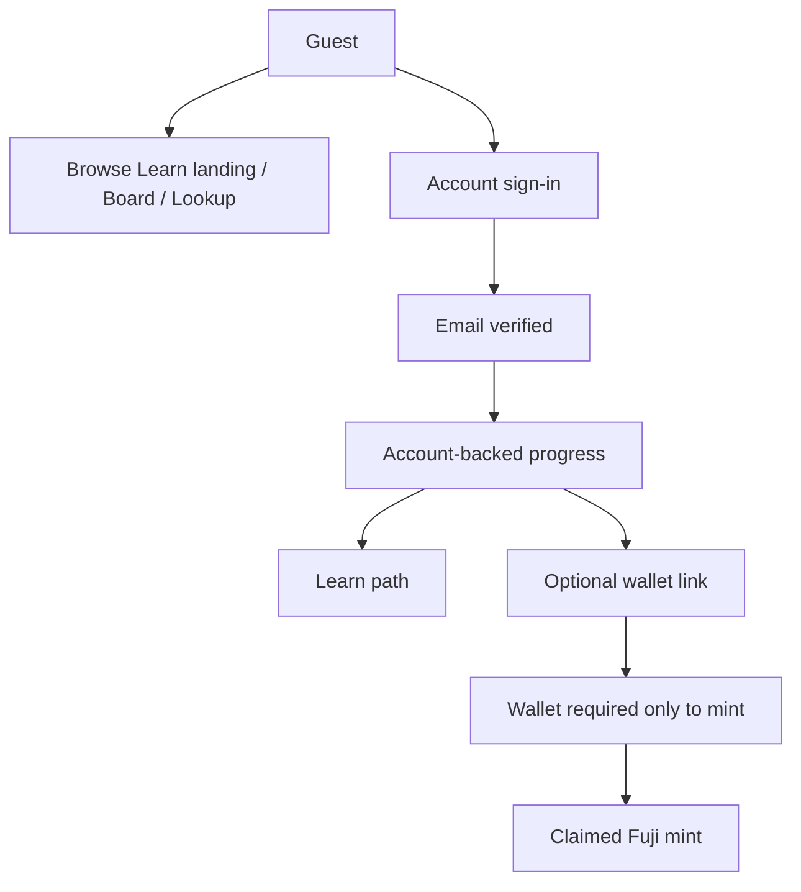
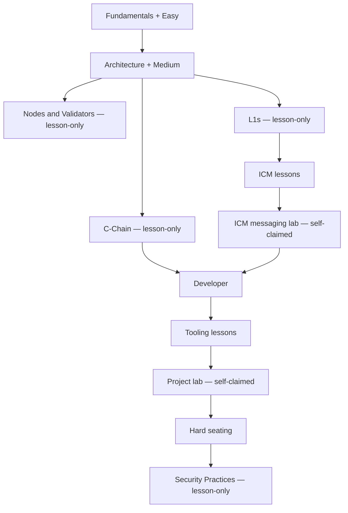
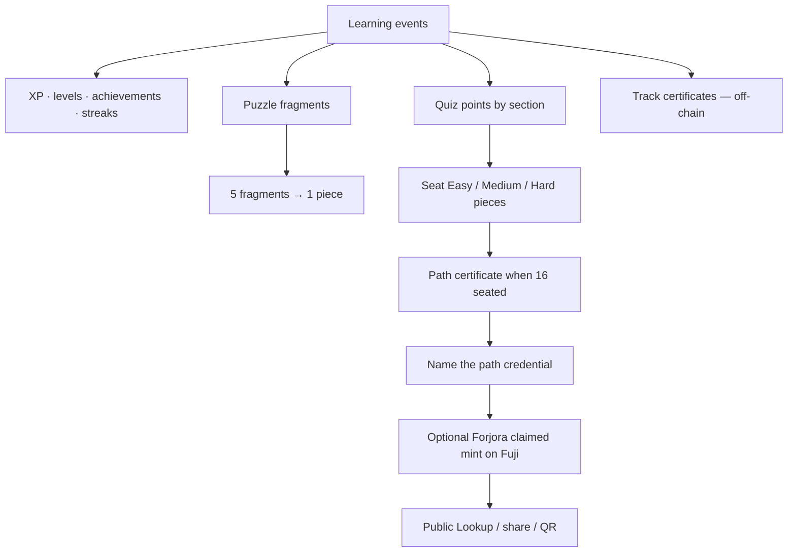
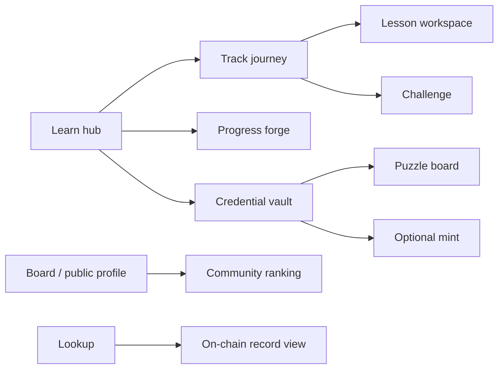
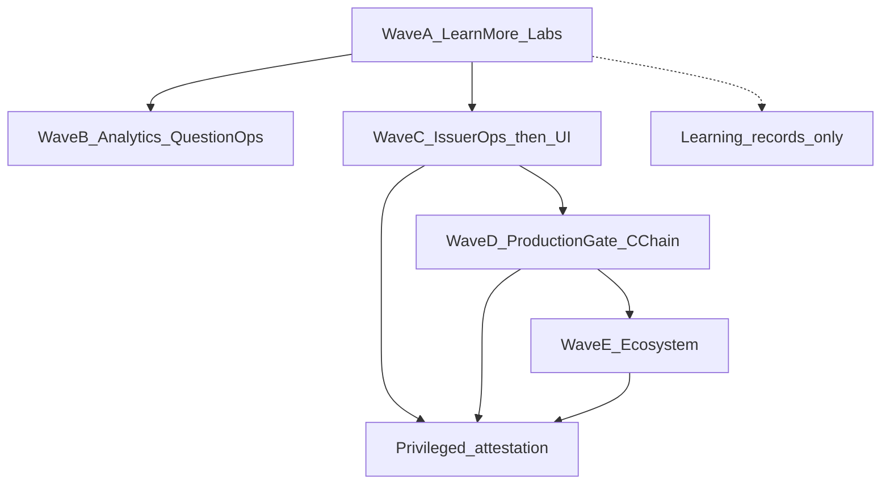

# Forjora — System flow

How the product moves a learner from account to proof — what ships today, and what can be added without blurring claimed learning with issuer attestation.

Related: [Status](./STATUS.md) · [Roadmap](./ROADMAP.md) · [Progression](./PROGRESSION.md) · [Credential](./CREDENTIAL.md) · [Architecture](./ARCHITECTURE.md)

---

## 1. Product loop (shipped)



| Stage | What happens today |
| --- | --- |
| Learn | Eight Avalanche tracks, ordered lessons, self-claimed labs on ICM and Developer |
| Challenge | Easy / Medium / Hard seating quizzes; Mastery deepens knowledge without changing Fuji seating |
| Earn | First-time XP, puzzle fragments, points; retries do not farm rewards |
| Unlock | Track and module gates; seating points unlock that quiz’s reserved pieces |
| Forge | Sixteen-piece puzzle, track certificates (off-chain), path snapshot |
| Prove | Optional claimed soulbound mint on Fuji; public Lookup / share URL / QR |

---

## 2. Identity and access (shipped)



- An **account** holds progress. A **wallet** is not a signup gate.
- Linking a wallet can adopt that browser’s quiz/puzzle snapshot onto the account; it does not become the account.
- Board standing and XP are not issuer-attested and not on-chain.

---

## 3. Learning path (shipped)



| Kind | Tracks | Seating effect |
| --- | --- | --- |
| Quiz tracks | Fundamentals, Architecture, Developer | Easy 3 / Medium 5 / Hard 8 pieces |
| Lesson tracks | Nodes, L1s, C-Chain, ICM (plus messaging lab), Security | Track certificate when complete; no seating quiz |
| Project labs | ICM messaging lab; Developer project lab before Hard | Self-claimed lessons only — not graded, not issuer-attested |

Puzzle seats **0–15** stay frozen. There is no fourth seating quiz.

---

## 4. Progress → certificates → on-chain (shipped)



Honesty:

| Record | Meaning |
| --- | --- |
| Track / learning certificate | Off-chain path progress |
| Project lab complete | Self-claimed learning activity |
| Forjora claimed mint | Learner published their own score snapshot on Fuji |
| Forjora issuer-attested | Contract owner authorized the record — **not** the default learner mint |

Looking up a Fuji record proves presence on-chain. It does not turn a claimed score into an issuer assessment.

---

## 5. Surfaces a learner meets (shipped)



---

## 6. What can be added (planned)

Extensions that fit the same honesty model — claimed learning stays distinct from attestation. Work is sequenced in waves that match the [roadmap](./ROADMAP.md) phases. Puzzle seats **0–15** stay frozen (Easy 3 / Medium 5 / Hard 8); there is no fourth seating quiz.

### Honesty (every wave)

- Lesson tracks, project labs, Board, and XP are **learning / community records**.
- **Forjora claimed** mint stays a self-published Fuji snapshot.
- **Issuer-attested** only via a privileged path (owner signature on-contract today; issuer ops later).
- Partners and third-party verify **attested** records only — never claimed scores or Board rank.

### Wave sequence



| Wave | Role | Depends on | Must not imply |
| --- | --- | --- | --- |
| **A** — More path content + richer labs | Deeper lesson-only tracks and self-claimed project labs | Shipped Fuji loop | Foundation exam, graded review, or issuer attestation |
| **B** — Learning analytics · question ops | Operator question bank and analytics | Wave A shipped | That analytics or bank edits change seating honesty or attestation |
| **C** — Issuer ops, then attested mint UI | Key custody + dashboard → attested mint in learner UI → revocation / versioning | Contract attested mint (shipped); Wave A does not block start | That claimed scores were always attested; Lookup alone as certification |
| **D** — C-Chain after production gate | Review → custody → monitoring → open gate → C-Chain deploy → E2E | Wave C issuer custody | That Fuji claimed equals a Mainnet diploma; env flag as launch approval |
| **E** — Ecosystem | Partners, collections, third-party verify of **attested** records | Wave D (production-ready attestation) | That Board rank or claimed mint is partner-attested |

### Wave A — shipped

Phase 2 path expansion. Puzzle seats **0–15** unchanged. No fourth seating quiz.

1. **Lesson-only track: Nodes & Validators** — prerequisites Architecture; parallel to L1s / C-Chain; three Builder Hub–linked lessons; track certificate (`kind: "track"`).
2. **Richer lab: ICM messaging lab** — brief → build → verify on ICM; self-claimed; does not add Hard seating (Hard stays on Developer).

Further lesson tracks or labs beyond this slice remain optional Phase 2 polish; Wave B is the next sequenced platform wave.

### Wave B — learning analytics and question ops

Phase 5. Operator-facing question bank management and learning analytics after Wave A. A partial operator surface can publish questions and summarize learning events. It does not change seating math or credential honesty, and it stays off the attested path. It is not a learner-progression agent.

### Wave C — issuer path (ops before UI)

Phase 3 / 5. Contract `mintCredentialWithAuthorization` and Lookup/vault display of attested records already ship; learner mint today is claimed-only.

1. Issuer key custody and dashboard (signing keys never in the learner browser).
2. Attested mint in the learner UI (submit owner authorization — not the default claimed button).
3. Revocation and versioning (product + contract; not in freeze v1).

### Wave D — production gate and C-Chain

Phase 6. Independent review of freeze v1 → issuer custody → monitoring → open the gate in source → C-Chain deploy → end-to-end checks. An env flag cannot open issuance. Claimed on C-Chain still is not attested.

### Wave E — ecosystem

Phase 7. Partners, institutions, collections, and third-party verification of **attested** credentials. Public achievement profiles (`/u/:slug`) already ship with the Board.

See [Roadmap](./ROADMAP.md) for phase status and [Status](./STATUS.md) for the not-shipped list tagged by wave.

A learner-progression agent and an MCP extensibility layer are **planned**. They are not part of the shipped loop above. The dashboard’s next activity is path order. See [Architecture](./ARCHITECTURE.md).

---

## 7. One-page map

```text
                    ACCOUNT (progress)          WALLET (optional → mint)
                           │                              │
                           ▼                              │
          ┌──────── Learn path (8 tracks) ────────┐       │
          │  lessons → labs (claimed) → quizzes   │       │
          └───────────────┬───────────────────────┘       │
                          ▼                               │
              XP · badges · streak · Board                │
                          │                               │
                          ▼                               │
              Puzzle (16) · track certs (off-chain)       │
                          │                               │
                          ▼                               │
              Path credential named ──────────────────────┘
                          │
                          ▼
              Claimed Fuji mint → Lookup
                          │
                          ╳  (not default)
                          ▼
              Issuer-attested  ← Wave C ops · UI; Wave D C-Chain; Wave E partners
```
