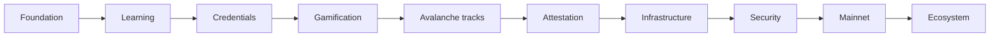

# SkillForge — Roadmap

**Goal:** Grow SkillForge from a Fuji learning product into a reliable, honest, issuer-capable skills credential platform on Avalanche.

> **Today:** Phase 1 is complete. Phases 2–5 are partially shipped. The soulbound credential is **live on Avalanche Fuji**. See [STATUS.md](./STATUS.md).

| Phase | Theme | Status |
| --- | --- | --- |
| 1 | Foundation & correctness | Complete |
| 2 | Learning experience | Partial |
| 3 | Credential system | Partial — contract live on Fuji |
| 4 | Gamification | Client preview |
| 5 | Avalanche tracks | Initial tracks shipped |
| 6–10 | Attestation ops → ecosystem | Planned |



## Phase 1 — Foundation ✅

Wallet and Fuji network, quiz banks, retry-safe scoring, durable local progress, puzzle redemption, soulbound contract, claimed vs attested on-chain, CI.

## Phase 2 — Learning experience 🟡

Shipped: product intro, first-run guidance, explanations after submit, official Avalanche references, persistent progress, dashboard.

Remaining: richer certificate polish and deeper path content beyond the first six tracks.

## Phase 3 — Credentials 🟡

Shipped: credential model, soulbound metadata, claimed vs attested, owner-signed attested mint on the contract, public lookup, QR/share URL.

Remaining: issuer-key operations, attested mint in the learner UI, versioning and revocation.

## Phase 4 — Gamification ✅ *Client preview*

Shipped: shared progression events, XP and levels, achievements, UTC streaks, path engine, interlocking puzzle and certificate reveal, opt-in local leaderboard.

Remaining: server-backed rankings and multi-device sync. Client rank is not a competitive authority.

## Phase 5 — Avalanche tracks ✅ *Initial*

Shipped: Fundamentals, Architecture, L1s, C-Chain, ICM, Developer — lessons plus mapped quizzes.

Remaining: more depth, specialized audiences, and a fuller knowledge graph.

## Phase 6 — Attestation & trust

Keep claimed and attested distinct. Add issuer accounts, an issuer dashboard, organization issuance, and clearer provenance for third parties.

## Phase 7 — Infrastructure

Move critical learner state off the browser. Sync progress, question quality, and content without treating localStorage as authority for credentials or rankings.

## Phase 8 — Security 🟡

Contract tests and soulbound rules are in place. Remaining: issuer-key risk, upgrade policy, independent audit before production issuance.

## Phase 9 — Mainnet

Freeze the production credential, complete review/audit, production metadata and issuer ops, then gate launch on security approval. Product copy must stay honest on mainnet.

## Phase 10 — Ecosystem

Partners, institutions, partner-issued credentials, collections, third-party verification, public achievement profiles — without pretending a claimed score is attested.

## Product loop

```text
LEARN → CHALLENGE → EARN XP / POINTS
       → LEVEL, BADGES, STREAK
       → PATH / TRACK
       → PUZZLE → CERTIFICATE → CREDENTIAL → LOOKUP
```

## Integrity

| Track | Objective |
| --- | --- |
| Learning | Make Avalanche concepts clear and sequential |
| GameFi | Make progress feel earned without farming |
| Credentials | Keep claimed scores honest; attestation is a separate, privileged path |

Related: [Status](./STATUS.md) · [Progression](./PROGRESSION.md) · [Credential](./CREDENTIAL.md)
