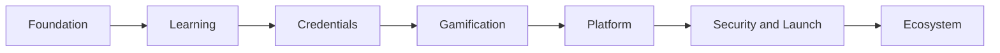

# SkillForge — Roadmap

**Goal:** Grow SkillForge from a Fuji learning product into a reliable, honest, issuer-capable skills credential platform on Avalanche.

> **Today:** Foundation is complete. Learning, credentials, gamification, and platform are partially shipped. The soulbound credential is **live on Avalanche Fuji**. The Security & Launch production readiness gate is **closed**. SkillForge is not independently audited and does not issue credentials on Avalanche C-Chain. See [STATUS.md](./STATUS.md).

| Phase | Theme | Status |
| --- | --- | --- |
| 1 | Foundation | Complete |
| 2 | Learning | Partial |
| 3 | Credentials | Partial — contract live on Fuji |
| 4 | Gamification | Live ranking from the event log |
| 5 | Platform | Partial — account-backed learner persistence |
| 6 | Security & Launch | Partial — production gate closed; audit and C-Chain issuance not shipped |
| 7 | Ecosystem | Planned |



## Phase 1 — Foundation ✅

Wallet and Fuji network, quiz banks, retry-safe scoring, durable local progress, puzzle redemption, soulbound contract, claimed vs attested on-chain.

## Phase 2 — Learning 🟡

Shipped: landing loop for guests, explanations after submit, official Avalanche references, persistent progress. After sign-in, learners go to Learn. Six initial tracks: Fundamentals, Architecture, L1s, C-Chain, ICM, Developer — lessons plus mapped quizzes.

Remaining: richer certificate polish and deeper path content beyond the first six tracks.

## Phase 3 — Credentials 🟡

Shipped: credential model, soulbound metadata, claimed vs attested, owner-signed attested mint on the contract, public lookup, QR/share URL.

Remaining: issuer-key operations, attested mint in the learner UI, versioning and revocation.

## Phase 4 — Gamification ✅ *Live ranking*

Shipped: shared progression events, XP and levels, achievements, UTC streaks, path engine, interlocking puzzle and certificate reveal, default-on live ranking from the append-only event log (learners can hide).

Remaining: a persisted XP ledger written only by a trusted service. Rank is not issuer-attested and not on-chain.

## Phase 5 — Platform 🟡

Shipped: learner accounts persist progress, quiz state, and puzzle state beyond a single browser. Wallets link to the account without becoming the account. Clients cannot write XP or rank.

Remaining: question management, learning analytics, issuer dashboard, and production monitoring. Live rank already replays the append-only event log.

## Phase 6 — Security & Launch

This is the production gate. It is **not** a claim that SkillForge is audited or live on Avalanche C-Chain.

The readiness gate is **closed**. Schema v1 metadata, Privacy/Terms disclosures, Fuji vs C-Chain RPC separation, and incident copy (no pause; two-step issuer handoff) are in place. Independent review, issuer infrastructure, a production deployer, monitoring, and C-Chain issuance are **not**. An env flag cannot open issuance.

Shipped on Fuji: soulbound transfer rules and owner-signed attestation. Contract tests cover unauthorized mint, forged and replayed signatures, wrong nonce, wrong chain, wrong contract, expired authorizations, unauthorized issuer and ownership changes, and duplicate current credentials. The learner app does not hold issuer keys; wallet, contract, and mint inputs are checked before a transaction is sent. Freeze v1 of the credential source is packed for independent review. That pack is **not** an audit.

Remaining before production issuance:

- Independent review of freeze v1 (the credential contract and issuer authorization)
- Redeploy the frozen credential before production issuance if the live Fuji address still lags this source
- Dedicated issuer operations and key custody (signing keys never live in the learner browser)
- Production monitoring and incident operations beyond documented v1 limits
- Open the production gate in source only after those items are ready, then C-Chain deploy
- End-to-end learner and issuer checks on Avalanche C-Chain

Product copy must stay honest on C-Chain: claimed scores are not issuer-attested. SkillForge does not issue credentials on C-Chain today.

## Phase 7 — Ecosystem

Partners, institutions, partner-issued credentials, collections, third-party verification, public achievement profiles — without pretending a claimed score is attested.

## Product loop

```text
LEARN → CHALLENGE → EARN XP / POINTS
       → LEVEL, BADGES, STREAK
       → PATH / TRACK
       → PUZZLE → CERTIFICATE → CREDENTIAL → LOOKUP
```

## Integrity

| Track | Objective |
| --- | --- |
| Learning | Make Avalanche concepts clear and sequential |
| GameFi | Make progress feel earned without farming |
| Credentials | Keep claimed scores honest; attestation is a separate, privileged path |
| Launch | Do not issue on mainnet until review, honest copy, and issuer keys are production-ready |

Related: [Status](./STATUS.md) · [Progression](./PROGRESSION.md) · [Credential](./CREDENTIAL.md) · [Authorization](./AUTHORIZATION.md)
