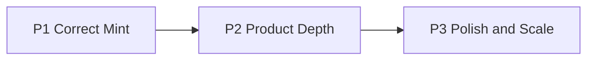
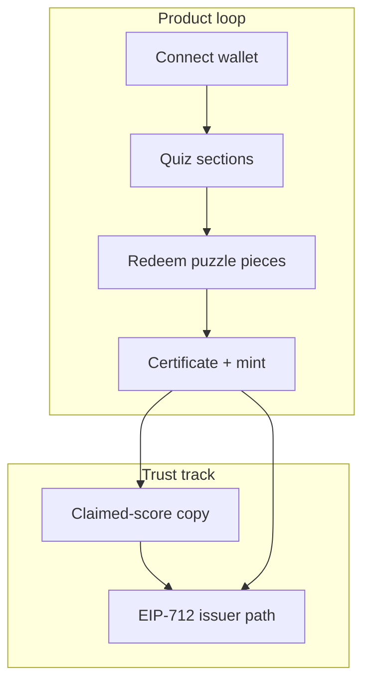

# SkillForge Dual-Track Roadmap

**Goal:** Make SkillForge trustworthy and demo-ready on Avalanche Fuji, then deepen product value (better learning loop + credentials that mean something).

**Near-term target:** Portfolio / shippable Fuji demo. Mainnet is a later phase gate.



---

## Status overview

| Phase | Focus | Status |
|-------|--------|--------|
| **P1** | Retry math, wallet/mint UX, honest credentials | Done |
| **P2** | Content, persistence, read path, landing polish | Done |
| **P3** | EIP-712 attestation, tests, CI, mainnet gate | Done (mainnet launch still gated) |

---

## Phase 1 — Correct game + mint loop

Make points, retries, and minting behave as the UI claims.

### App logic

- **Retry points** — [`src/utils/progress.js`](../src/utils/progress.js) + [`src/App.jsx`](../src/App.jsx): recompute totals from `sectionScores` so retries replace, not stack
- **Wallet session** — [`src/hooks/useWallet.js`](../src/hooks/useWallet.js): validate restored address against the provider; memoize `publicClient`
- **Mint UX** — [`src/components/Certificate.jsx`](../src/components/Certificate.jsx): Fuji check, wait for receipt, Snowtrace link, clearer errors

### Credential honesty

Keep open `mintCredential` for Fuji demo speed, with clear product copy:

- “Verifiable” means an **on-chain record of claimed scores**, not a proctored exam
- Store a short stable image URI (`VITE_CREDENTIAL_IMAGE_URI`), not a Vite `/assets/...` path
- [`src/utils/ipfs.js`](../src/utils/ipfs.js) resolves a durable HTTPS/IPFS URI
- [`src/utils/contract.js`](../src/utils/contract.js) ABI includes `image` on `credentials`

**Exit criteria**

- Retry does not inflate points
- Mint confirms on Fuji with a resolvable image
- ABI matches contract

**Deploy note**

```bash
npm run compile
npm run deploy:fuji
# set VITE_CREDENTIAL_CONTRACT and VITE_CREDENTIAL_IMAGE_URI, then restart the app
```

---

## Phase 2 — Product depth

Grow the learning product without rewriting the stack.

1. **Content** — Expanded pools in [`src/data/questions.js`](../src/data/questions.js) (ICM, L1s, staking depth)
2. **Progress persistence** — Per-wallet `localStorage` via [`src/utils/progress.js`](../src/utils/progress.js)
3. **Achievements / dashboard** — [`Achievements.jsx`](../src/components/Achievements.jsx), [`Dashboard.jsx`](../src/components/Dashboard.jsx) reflect saved stats
4. **Read path** — Certificate loads `credentialOf` / `credentials` / `tokenURI` and links to Snowtrace
5. **Landing polish** — Brand-first hero in [`Landing.jsx`](../src/components/Landing.jsx) + CSS

**Exit criteria**

- Returning users resume progress
- Certificate page reflects chain state
- Landing feels intentional

---

## Phase 3 — Scale / credibility

| Item | Implementation |
|------|----------------|
| Stronger attestation | `mintCredentialWithAuthorization` (EIP-712, owner-signed, non-replayable) in the credential contract |
| Tests | [`test/SkillForgeCredential.js`](../test/SkillForgeCredential.js), [`scripts/check-retry-math.js`](../scripts/check-retry-math.js) |
| CI | [`.github/workflows/ci.yml`](../.github/workflows/ci.yml) — lint, compile, tests, build |
| Mainnet gate | Documented checklist in [README](../README.md); `npm run deploy:mainnet` only after review/attestation readiness |

**Mainnet checklist (do not skip)**

1. Reviewed / audited contract build
2. Prefer signed authorization path with an issuer key
3. Dedicated mainnet RPC + deployer key outside git
4. Clear risk copy in the product UI before pointing users at C-Chain mainnet

---

## Suggested sequencing

| Week | Focus |
|------|--------|
| 1 | P1 retry math, wallet/mint UX, image URI, ABI, Fuji deploy |
| 2–3 | P2 persistence, read credential, content expansion |
| 3–4 | P2 landing polish + achievements |
| Later | P3 attestation usage in product, CI discipline, mainnet decision |

Most engineering work for P1–P3 is in-tree. Refresh the live Fuji address after you deploy.

---

## Feature map (product + tech)



---

## Out of scope (this roadmap)

- Full backend LMS / accounts
- Mobile native apps
- Mainnet launch as part of P1–P2

---

## Related docs

- [README](../README.md) — quick start, env, deploy, mainnet gate
- [`.env.example`](../.env.example) — required environment variables
- Contract: [`contracts/SkillForgeCredential.sol`](../contracts/SkillForgeCredential.sol)
