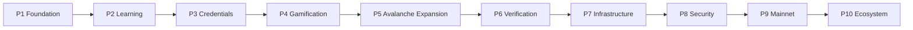
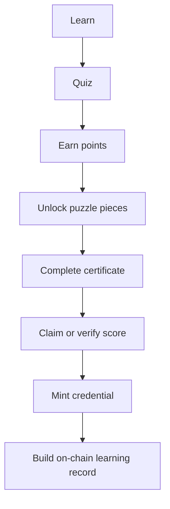
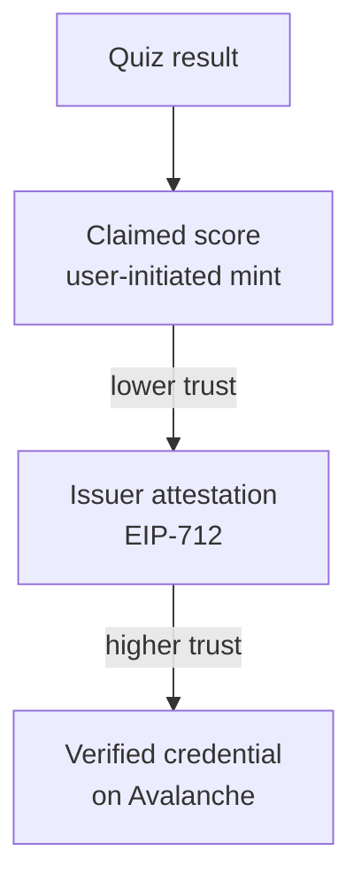
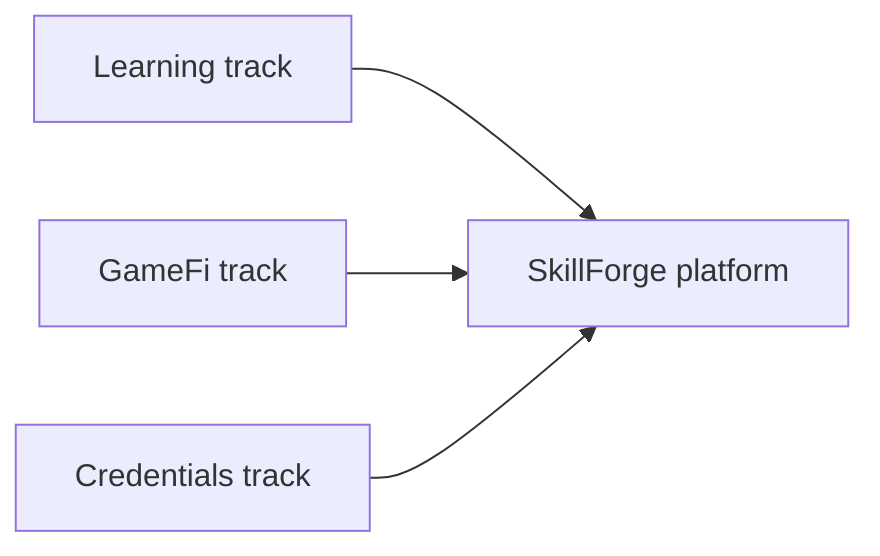

# SkillForge — Roadmap

**Goal:** Evolve SkillForge from a Fuji-based Avalanche learning prototype into a reliable, issuer-attested, gamified skills-credentialing platform.

> **Current progress:** Phase 1 is complete. Phases 2–3 are partially shipped. `SkillForgeCredential` is **live on Avalanche Fuji**. See **[STATUS.md](./STATUS.md)** for the live address and implementation checklist.

| Phase | Theme | Status |
| --- | --- | --- |
| **1** | Foundation & correctness | **Complete** |
| **2** | Learning experience | **Partial** |
| **3** | Credential system | **Partial** — contract live on Fuji |
| **4–10** | Gamification → ecosystem | Planned |



---

## Phase 1 — Foundation & Correctness ✅ *Complete*

- ✅ Stabilize wallet connection and network switching
- ✅ Validate MetaMask and Core Wallet flows
- ✅ Harden quiz generation and randomization
- ✅ Finalize Easy / Medium / Hard question banks (8 questions per tier)
- ✅ Verify retry-safe scoring across all quiz sections
- ✅ Ensure localStorage state recovery is reliable
- ✅ Validate puzzle-point redemption logic
- ✅ Review contract ownership and access control
- ✅ Fix and verify credential score handling
- ✅ Add comprehensive smart-contract and frontend tests
- ✅ Establish CI checks for linting, compilation, tests, and builds

---

## Phase 2 — Learning Experience 🟡 *Partial*

- ✅ Improve onboarding for new Avalanche learners *(product intro, first-run loop, empty/error states)*
- ✅ Introduce clearer learning objectives for each difficulty tier
- 🟡 Add explanations after quiz answers *(hints + fun facts shipped; not full explanations)*
- 🟡 Add Avalanche ecosystem learning references *(embedded in question copy)*
- 🟡 Expand ICM and Avalanche L1 content *(present in banks; not structured paths)*
- 🟡 Improve quiz feedback and progress indicators *(dashboard + achievements)*
- ✅ Add persistent learner progression
- 🟡 Introduce completion statistics
- ✅ Improve puzzle redemption experience
- 🟡 Add certificate preview before minting *(certificate view exists; polish remaining)*

---

## Phase 3 — Credential System 🟡 *Partial*

- ✅ Define the SkillForge credential data model
- ✅ Finalize soulbound credential metadata
- 🟡 Use stable IPFS/HTTPS metadata and artwork *(operator sets `VITE_CREDENTIAL_IMAGE_URI`)*
- ✅ Separate claimed scores from issuer-attested scores
- ✅ Implement `mintCredentialWithAuthorization` as the preferred verified path *(contract; UI still self-claim)*
- ✅ Harden EIP-712 authorization and nonce handling
- ✅ Prevent signature replay and unauthorized issuance
- 🟡 Define issuer-key management procedures
- 🟡 Add credential verification UI *(on-chain read + attested label; no public verify page)*
- ✅ Allow users to view their on-chain learning record
- ⬜ Establish credential versioning/revocation strategy

---

## Phase 4 — Gamification

- Introduce XP and achievement mechanics
- Add badges for learning milestones
- Create streak and completion mechanics
- Add achievement-based puzzle pieces
- Introduce multiple certificate/puzzle collections
- Add learner levels
- Create optional challenges beyond the core quizzes
- Add leaderboards where appropriate
- Prevent gamification mechanics from compromising credential integrity

---

## Phase 5 — Avalanche Learning Expansion

- Expand Avalanche fundamentals
- Add Avalanche L1 concepts
- Expand ICM learning paths
- Add C-Chain / EVM content
- Add subnet/L1 architecture challenges
- Add Avalanche developer-focused tracks
- Create beginner → intermediate → advanced learning paths
- Introduce specialized tracks for developers, founders, and ecosystem participants
- Build a structured Avalanche knowledge graph/question taxonomy

---

## Phase 6 — Verification & Trust

- Establish distinction between self-claimed and verified credentials
- Introduce issuer accounts
- Create an issuer dashboard
- Allow authorized organizations to issue credentials
- Add issuer-specific signing keys
- Build credential verification links/pages
- Add QR-based credential verification
- Provide public credential lookup
- Define credential authenticity and provenance rules
- Document the verification model clearly

---

## Phase 7 — Platform Infrastructure

- Move critical learner state from localStorage to persistent backend storage
- Introduce wallet-based user profiles
- Add database-backed progress synchronization
- Implement backend APIs where required
- Add analytics for learning progression
- Track quiz performance and question quality
- Add content-management capabilities for question banks
- Separate quiz content from application code
- Establish production monitoring and error tracking

---

## Phase 8 — Security & Smart-Contract Hardening 🟡 *Partial*

- 🟡 Perform comprehensive contract review *(internal review + expanded tests)*
- ✅ Add adversarial tests for mint authorization
- ✅ Test replay, nonce, signature, and ownership scenarios
- ✅ Review soulbound transfer restrictions
- ✅ Review metadata immutability/security *(OpenZeppelin Base64; invalid image rejected)*
- 🟡 Review issuer-key exposure risks
- ✅ Remove unnecessary privileged operations
- ✅ Add deployment verification *(Fuji live; Snowtrace record in STATUS.md)*
- ⬜ Establish contract upgrade policy, if upgrades are supported
- ⬜ Conduct an independent security audit before production credential issuance

---

## Phase 9 — Mainnet Readiness

- Freeze the production contract specification
- Complete security review/audit
- Validate production metadata and artwork
- Establish secure issuer infrastructure
- Configure production RPC infrastructure
- Configure secure deployment credentials
- Verify production contract deployment
- Test complete learner → quiz → redemption → credential flow
- Update product disclosures and credential terminology
- Add production monitoring
- Establish incident-response procedures
- Gate mainnet deployment behind final security approval

---

## Phase 10 — Ecosystem & Scale

- Build an Avalanche ecosystem partner/issuer model
- Support educational institutions and developer communities
- Create organization-specific learning tracks
- Enable partner-issued credentials
- Introduce credential collections
- Build APIs for third-party credential verification
- Support integrations with portfolios and professional profiles
- Create public learner achievement profiles
- Explore cross-platform credential interoperability
- Expand beyond Avalanche while preserving Avalanche-native credentials

---

## Core Product Loop

```text
LEARN
  ↓
QUIZ
  ↓
EARN POINTS
  ↓
UNLOCK PUZZLE PIECES
  ↓
COMPLETE CERTIFICATE
  ↓
CLAIM / VERIFY SCORE
  ↓
MINT CREDENTIAL
  ↓
BUILD ON-CHAIN LEARNING RECORD
```



---

## Credential Integrity Model

```text
                 ┌──────────────────────┐
                 │      Quiz Result     │
                 └──────────┬───────────┘
                            │
                 ┌──────────▼───────────┐
                 │    Claimed Score     │
                 │  User-initiated mint │
                 └──────────┬───────────┘
                            │
                      Lower trust
                            │
                ────────────┼────────────
                            │
                   Higher trust
                            │
                 ┌──────────▼───────────┐
                 │ Issuer Attestation   │
                 │      EIP-712         │
                 └──────────┬───────────┘
                            │
                 ┌──────────▼───────────┐
                 │ Verified Credential  │
                 │    On Avalanche      │
                 └──────────────────────┘
```



---

## Strategic Priority

The roadmap maintains three parallel tracks:

| Track | Primary objective |
|-------|-------------------|
| **Learning** | Make SkillForge an effective Avalanche learning experience |
| **GameFi** | Make progression, points, puzzles, and achievements engaging |
| **Credentials** | Make on-chain achievements trustworthy and verifiable |



---

## Related docs

- [STATUS.md](./STATUS.md) — what is shipped today (tests, contracts, UI)
- [README](../README.md) — quick start, env, deploy, mainnet gate, CI
- [`.env.example`](../.env.example) — required environment variables
- Contract: [`contracts/SkillForgeCredential.sol`](../contracts/SkillForgeCredential.sol)
